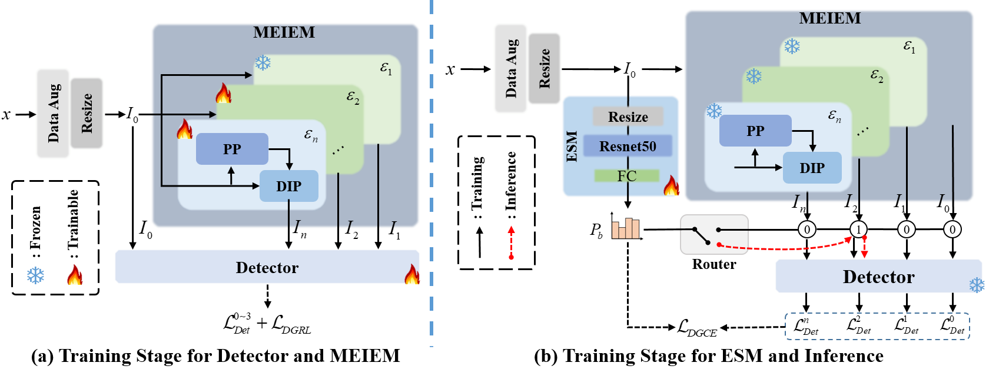
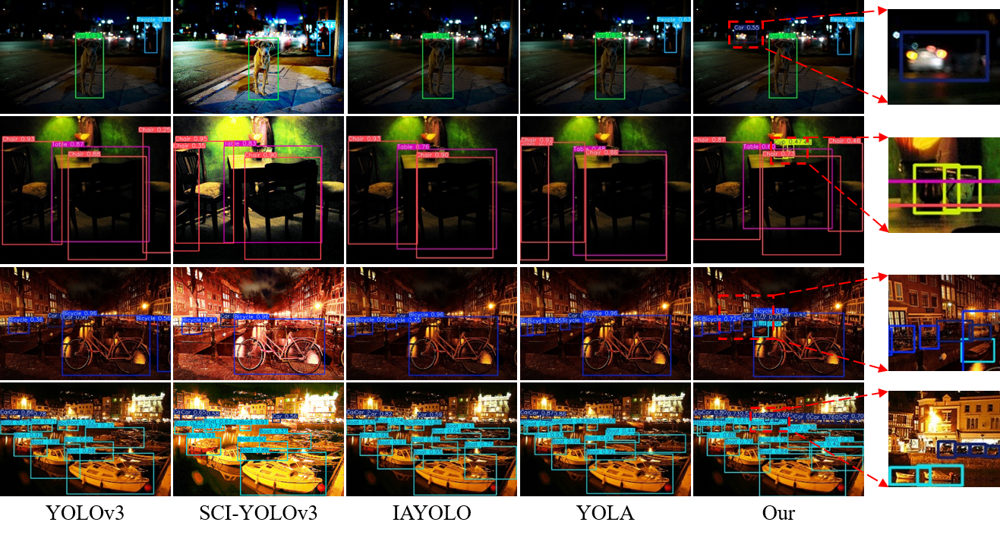
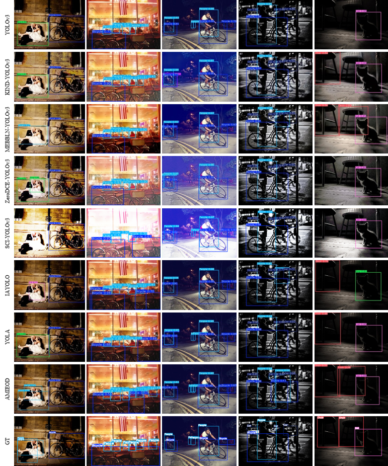
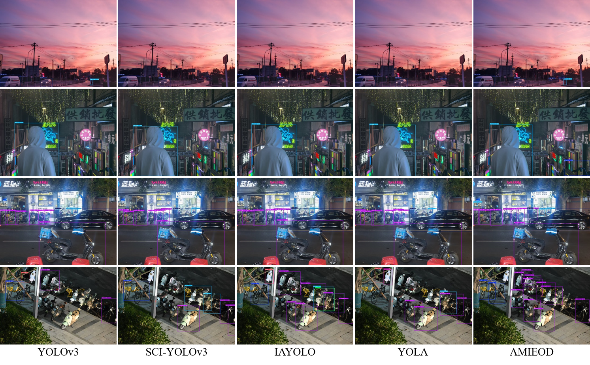
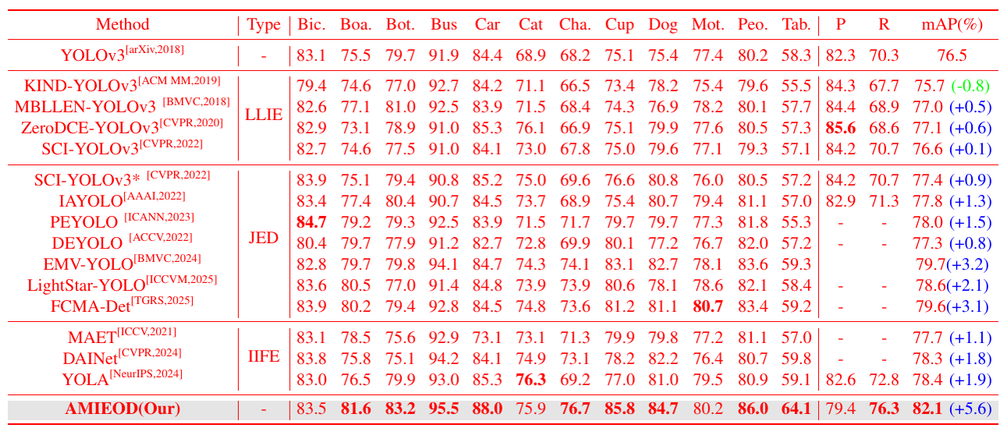

### Environment

```bash
conda create -n your_env_name python==3.8.20
pip install ultralytics
pip install -r requirements.txt  # install
```

**Model and data download**

https://pan.baidu.com/s/1lIBOiBtvU03DLLHHXO8ieA?pwd=vsst password: vsst

Download the dataset as guided by [MAET](https://github.com/cuiziteng/ICCV_MAET).

### Train


```bash
python train_stage1.py --weights "path/to/yolov3.pt" --data exdark.yaml --epochs 100 --cfg yolov3.yaml  --batch-size 8
python train_stage2.py --weights "path/to/stage1_model.pt" --data exdark.yaml --epochs 30 --cfg yolov3.yaml --batch-size 1       
```

### Test

```
python val_AMIEOD.py --weights "path/to/stage2_model" --data exdark.yaml --batch-size 1  
```

### The overview of AMIEOD



### Visualization results on ExDark datasets.





### Visualization results on images captured in practical dusk and night scenarios.



### Quantitative comparison on ExDark.


## Citation

Thanks for the open-source code of [Ultralytics](https://github.com/ultralytics), [Image-Adaptive-YOLO](https://github.com/wenyyu/Image-Adaptive-YOLO),[SCI](https://github.com/vis-opt-group/SCI/tree/main)


